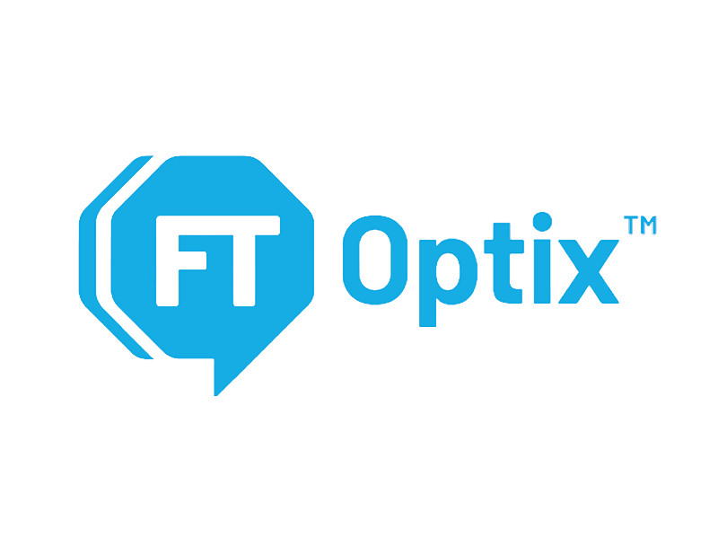
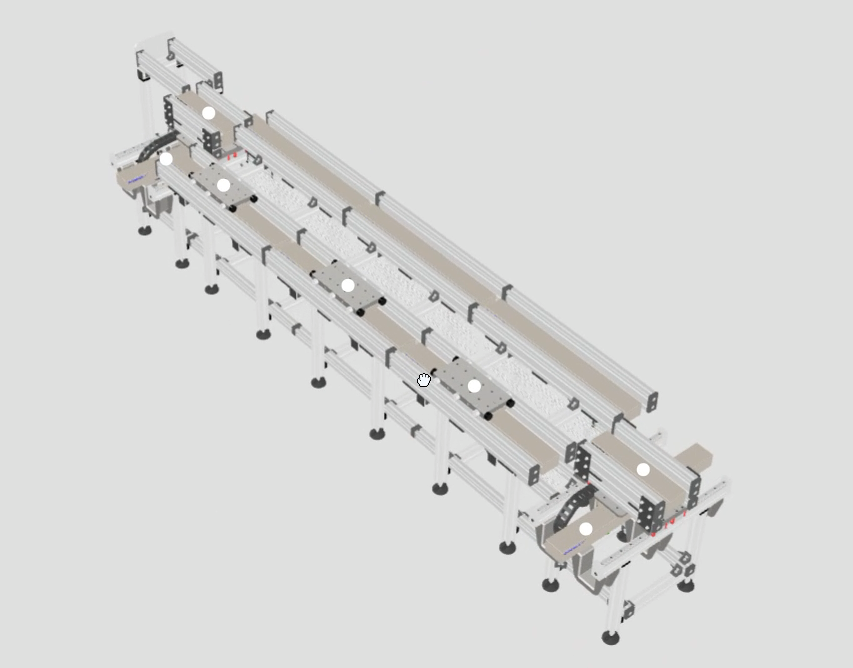
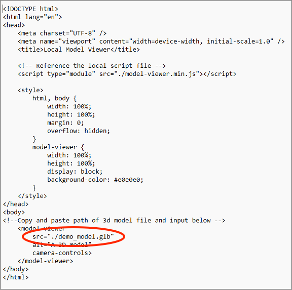
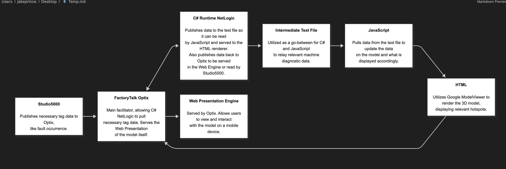
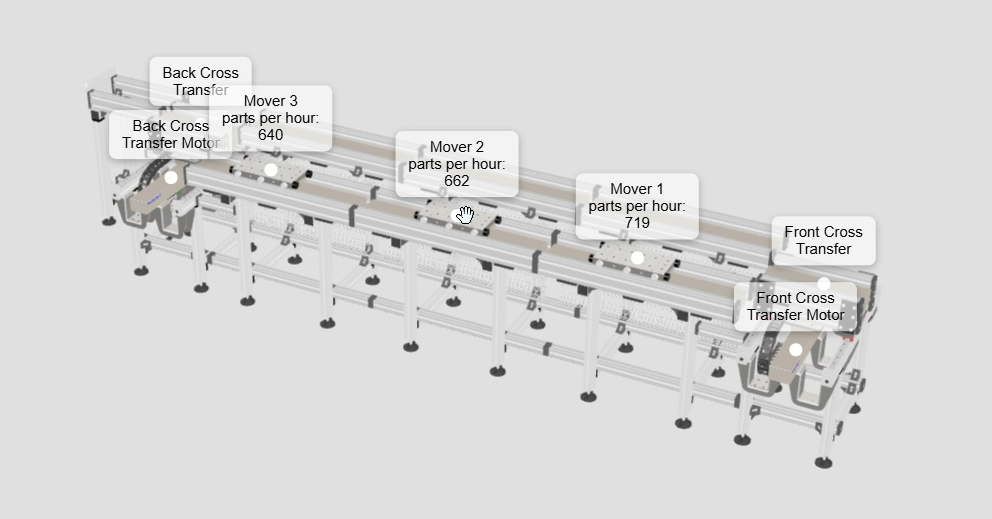
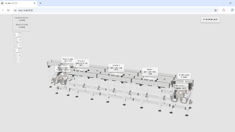

<table>
  <tr>
    <td align="center" valign="middle">
      
    </td>
    <td align="center" valign="middle">
      
    </td>
  </tr>
</table>

# FactoryTalk Optix 3D Model Viewer

## Description

The **FactoryTalk Optix 3D Model Viewer** allows users of the FactoryTalk Optix human-machine interface (HMI) platform to view and interact with 3D models of their machines.

Using the native web presentation engine, the viewer can support capabilities such as:

- Diagnostic monitoring
- Fault-location detection
- Process visualization
- Maintenance workflow optimization

<p align="center">
  
</p>

## Table of Contents

- [Quickstart Guide](#quickstart-guide)
- [Features](#features)
- [Architecture Diagram](#architecture-diagram)
- [Usage Examples](#usage-examples)
  - [Multi-Model Viewing](#multi-model-viewing)
  - [Real-Time Diagnostics](#real-time-diagnostics)
  - [Single-Part Isolation](#single-part-isolation)
- [Frequently Asked Questions](#frequently-asked-questions)

## Quickstart Guide

### Prerequisites

Before getting started, make sure you have:

- A FactoryTalk Optix project
- A 3D model in `.glb` or `.gltf` format
- A text editor
- Access to the FactoryTalk Optix web presentation engine

### Installation

1. Download the package named `3d_viewer_materials`.

   This package contains:

   - The demo application
   - The viewer package required to display 3D models in FactoryTalk Optix

2. Extract the `FTOptix_3d_Viewer` folder.

3. Copy the `FTOptix_3d_Viewer` folder into the **ProjectFiles** folder of the FactoryTalk Optix project in which you want to display a 3D model.

4. Copy your `.glb` or `.gltf` model into the `FTOptix_3d_Viewer` folder.

5. Open `FTOptix_3d_Viewer/index.html` in your preferred text editor.

6. Find the model source attribute:

   ```html
   src="./demo_model.glb"
   ```

7. Replace it with the path to your model. For example:

   ```html
   src="./your-model.glb"
   ```

   Make sure the filename and extension exactly match the model file you copied into the folder.

8. In your FactoryTalk Optix project, set the path of the Web Browser object to the `index.html` file in the ProjectFiles folder.

9. Run the project through the FactoryTalk Optix web presentation engine.

Your 3D model should now be visible and interactive.

> [!NOTE]
> The exact Web Browser path may depend on your FactoryTalk Optix project structure and deployment configuration.

<p align="center">
  
</p>

## Features

The viewer package can be extended using HTML, CSS, and JavaScript. Potential capabilities include:

### Real-Time Fault Detection

Display faults directly on the 3D model and present troubleshooting information, helping technicians diagnose issues and return the machine to operation more quickly.

### Throughput Monitoring

Visualize production throughput and identify potential bottlenecks in a machine or manufacturing cell.

### Individual-Part Monitoring

Monitor individual components to determine whether a part requires maintenance, replacement, or an update.

### Multi-Model Viewing

Switch between multiple models or machine views. For example, an operator could move from the main machine model to an electrical-cabinet model based on the active fault.

## Architecture Diagram

The following architecture diagram illustrates an advanced use case that incorporates:

- Fault monitoring
- Model switching
- Real-time parts-per-hour statistics for different movers in the machine

<p align="center">
  
</p>

## Usage Examples

The following examples demonstrate some of the advanced capabilities described above.

### Multi-Model Viewing

Switch between multiple 3D models or machine views.

<p align="center">
  
</p>

### Real-Time Diagnostics

Display real-time diagnostic information, such as parts-per-hour statistics.

<p align="center">
  
</p>

### Single-Part Isolation

Isolate and focus on an individual machine component for inspection or diagnosis.

<p align="center">
  
</p>

## Frequently Asked Questions

### Can I view the 3D models on native Optix displays?

No. Native Optix displays do not have an embedded graphics processing unit (GPU) capable of rendering the 3D models. The web presentation engine must therefore be used.

### How do I add text to models, as shown in the advanced-feature demo?

Use the open-source [Model Viewer Editor](https://modelviewer.dev/editor/) to add **hotspots** to your model. Hotspots can be configured to display text and other data points.

### How long does it take to display a model after downloading the package?

An experienced user may complete the process in approximately five minutes. A new user following this guide should generally be able to display a model within ten minutes.
```
